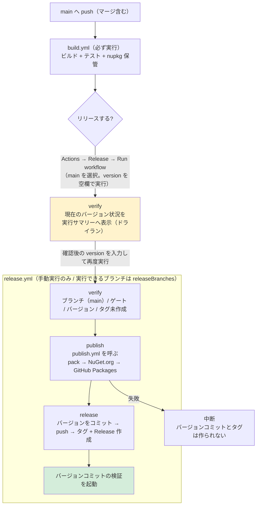
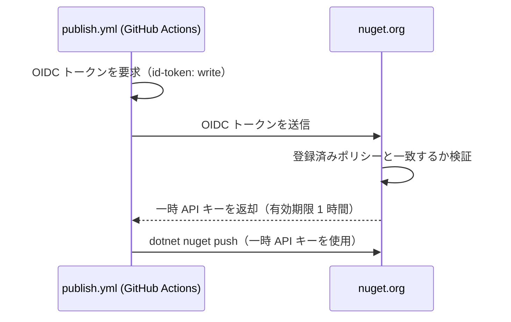

# リリース手順（GitHub Actions）

本ドキュメントは EsUtil.Text.ZenHanConverter の**リリース作業を行う開発者**向けの情報です。
ライブラリの利用方法は [`../README.md`](../README.md)、詳細仕様は [`../Spec.md`](../Spec.md)、
他のリポジトリへの流用方法は [`REUSING.md`](REUSING.md) を参照してください。

リリースは **手動実行のみ**です。バージョンの**自動インクリメントは行いません**。

## 構成

リリースの設定と処理は、次のファイルが持ちます。

| ファイル | 内容 |
| --- | --- |
| [`release-config.json`](release-config.json) | プロダクト名、バージョンファイル、**ビルド対象のソリューション ファイル**、ゲートのワークフロー、**リリースを許可するブランチ**、パッケージの定義、NuGet.org の接続先 |
| [`actions/read-config`](actions/read-config/action.yml) | `release-config.json` を読んで各ワークフローへ渡す共通アクション（読み取りの実装はここだけ） |
| [`../Directory.Build.props`](../Directory.Build.props) | リリースバージョン（`<Version>`）。各 `.csproj` では指定しない |
| [`../global.json`](../global.json) | .NET SDK のバージョン。ワークフローでは指定しない |
| [`workflows/publish.yml`](workflows/publish.yml) | pack と公開（NuGet.org / GitHub Packages）の実装（`release.yml` が呼ぶ） |
| [`scripts/version.ps1`](scripts/version.ps1) | バージョンの規則（形式・比較・系列・プレリリース判定・タグの列挙） |

パッケージの追加・変更は **`release-config.json` の `packages[]` を編集します**（ワークフローとスクリプトの変更は不要です）。
**ビルド・テスト・pack の対象は `solutionFile` が持ちます**（ワークフローには書きません）。
**リリースを許可するブランチは `releaseBranches` が持ちます**（本リポジトリは `["main", "release/**"]`。
`release/` 配下は **`release/<major>.<minor>` の形式**に限定され、入力バージョンの系列と一致させる必要があります）。

```text
<リポジトリルート>/
├── Directory.Build.props     # リリースバージョン（各 .csproj では指定しない）
├── global.json               # .NET SDK のバージョン（ワークフローでは指定しない）
└── .github/
    ├── release-config.json        # リリース設定（リポジトリ固有の設定はこのファイルのみ）
    ├── actions/
    │   └── read-config/
    │       └── action.yml         # release-config.json を読む共通アクション
    ├── dependabot.yml             # GitHub Actions / NuGet の更新 PR
    ├── RELEASE.md                 # 本ドキュメント
    ├── REUSING.md                 # 他のリポジトリへの流用方法
    ├── rulesets/
    │   └── tag-version.json       # Tag ruleset の定義（Settings へインポートする）
    ├── scripts/
    │   ├── version.ps1            # バージョンの規則
    │   ├── set-version.ps1        # バージョンファイルの書き換え（冪等）
    │   ├── verify-release-version.ps1  # リリース可否の検証
    │   └── show-current-versions.ps1   # 現在のバージョン状況の表示
    └── workflows/
        ├── build.yml              # push / PR でビルド・テスト・pack（公開しない）
        ├── publish.yml            # pack と公開（release.yml から呼ばれる）
        └── release.yml            # 手動実行で検証・公開・タグ・Release 作成
```

**注意事項**:

- リリースバージョンは `Directory.Build.props` の `<Version>` に記載し、**各 `.csproj` には記載しないでください**。
  リリース時に `release.yml` がこの 1 行を入力値へ書き換えてコミットします。
- **.NET SDK のバージョンは `global.json` に記載し、ワークフローには記載しないでください**
  （`actions/setup-dotnet` が `global.json` を読むため、`dotnet-version` の指定は不要です）。
- 同じ設定を複数箇所に置かないでください（例: パッケージの定義をワークフローへ直接書く、ソリューション名をワークフローへ書く、バージョンを `.csproj` にも書く、SDK のバージョンをワークフローにも書く）。
  変更時の注意事項は [`REUSING.md`](REUSING.md) にも記載しています。
- **`build.yml` / `publish.yml` / `release.yml` は全リポジトリで同一の内容です**（リポジトリ固有の値は
  `release-config.json` が持ちます）。ワークフローへリポジトリ名・ソリューション名・パッケージ ID を
  書き戻さないでください（流用時にそのままコピーできる状態を保ちます）。

## 依存関係の更新（Dependabot）

[`dependabot.yml`](dependabot.yml) が、GitHub Actions と NuGet パッケージの更新 Pull Request を作成します。

| 対象 | 間隔 | まとめ方 |
| --- | --- | --- |
| GitHub Actions（`uses:` で参照しているアクション） | 毎週月曜 09:00（Asia/Tokyo） | すべてを 1 つの Pull Request にまとめる |
| NuGet（`/src` と `/test` の `.csproj`） | 毎月 | minor / patch を 1 つの Pull Request にまとめる |

**注意事項**:

- Dependabot の Pull Request は**読み取り専用トークン・シークレット無し**で実行されます。`build.yml` はシークレットを使わないため、CI はそのまま動作します。
- **NuGet のメジャー更新（例: xunit 3 系）は作成されません**（テストの書き方が変わるため、手動で判断します）。
- Pull Request の内容を確認して `main` へマージします（マージ方式は Squash merge を推奨）。マージ後の `main` への push で `build.yml`（ゲート）が実行されます。
- 破壊的な変更（`actions/upload-artifact` のメジャー更新など）は、CI が失敗した内容を確認して修正します。

## リポジトリの設定（初回のみ）

次はワークフローでは設定できません。リポジトリの **Settings** で有効化します。

### タグの保護（Tag ruleset）

タグ（`v*`）の作成・更新・削除をワークフロー経由に限定します。定義は
[`rulesets/tag-version.json`](rulesets/tag-version.json) にあります。

| 項目 | 値 |
| --- | --- |
| Ruleset name | `Protect version tags` |
| Target | **Tags** |
| Enforcement status | **Active** |
| Target tags | `v*`（内部的には `refs/tags/v*`） |
| Tag protections | **Restrict creations** / **Restrict updates** / **Restrict deletions** / **Block force pushes** |
| Bypass list | **GitHub Actions**（アプリ。ID `15368`） |

**設定手順**:

1. **Settings → Rules → Rulesets** を開く
2. **New ruleset** のドロップダウンから **Import a ruleset** を選び、`rulesets/tag-version.json` を指定する
   - インポートできない場合は **New tag ruleset** で上表のとおり手動設定する
3. 内容を確認して **Create** を押下する

**注意事項**:

- `release.yml` は `GITHUB_TOKEN`（= GitHub Actions アプリ）でタグを作成するため、**bypass に GitHub Actions を追加しないとリリースが失敗します**。
- 導入後は、**Actions → Release** を 1 度実行してタグ作成が通ることを確認してください。
- ローカルからの `git push origin v1.0.1` や `git push --tags` は拒否されます（タグは Release 実行時に作成します）。
- 定義を変更した場合は、**同じ JSON の値と実際の ruleset を一致**させてください（ruleset はコードから自動適用されないため、変更時は手動で更新します）。

## ワークフロー

| ワークフロー | 実行契機 | 内容 |
| --- | --- | --- |
| [`workflows/build.yml`](workflows/build.yml) | `main` への push、`main` 向け PR（**必ず実行**）、`release/**` への push、手動実行（dev など任意のブランチ） | ビルド・テスト・pack の検証・nupkg の保管（**公開は行わない**） |
| [`workflows/publish.yml`](workflows/publish.yml) | `workflow_call` | pack と公開の単一実装（`version` を受け取るとそのバージョンで pack する） |
| [`workflows/release.yml`](workflows/release.yml) | **手動実行のみ。実行ブランチは `releaseBranches` に従う**（`version` 未入力ならドライラン） | 検証 → pack と公開 → バージョンコミット → タグ + GitHub Release 作成 |

`build.yml` の成功実行はリリースの**前提（ゲート）**です。`release.yml` は、リリース対象コミット（`main`）に対する `build.yml` の成功実行が存在することを確認してから Release を作成します。



## リリース手順

**事前準備（初回のみ）**: nuget.org の Trusted Publishing ポリシーを登録します
（[登録手順](#nugetorg-の-trusted-publishing-ポリシーの登録手順)）。ポリシーはリポジトリ単位で、
**公開するパッケージ ID（`EsUtil.Text.ZenHanConverter`）を明示**して登録します。

1. `dev` の変更を `main` へマージ（push）する
2. `Actions` → **Build** が成功するまで待つ（`dev` への push では Build は実行されません）
3. **現在のバージョンを確認する**（まだ `version` を入力しない）
   - `Actions` → **Release** → `Run workflow` を開き、**実行ブランチに `main` を選び、`version` を空欄のまま実行**する
   - リリースは行われず、**実行サマリーに現在のバージョン（`<Version>`・タグ・GitHub Release・NuGet.org の公開状況）が表示されます**
   - リリース前の事前確認であるため、実行ブランチの検証やゲートの確認も行いません（失敗しません）
4. サマリーの「`version` に入力する値」を確認し、`version` にリリースするバージョンを入力して、もう一度 **Run workflow** を実行する
5. ログの「結果をまとめ」でバージョン・タグ・対象コミットを確認する
6. NuGet.org と GitHub Packages に反映されていることを確認する
   - <https://www.nuget.org/packages/EsUtil.Text.ZenHanConverter>
   - <https://github.com/tomokuni/EsUtil.Text.ZenHanConverter/pkgs/nuget/EsUtil.Text.ZenHanConverter>

**注意事項**:

- **リリースできるブランチは `release-config.json` の `releaseBranches` が決めます**（本リポジトリは `["main", "release/**"]`）。
  `verify` ジョブが最初に実行ブランチを検証し、含まれない場合は失敗します。
  `release/` 配下のブランチは **`release/<major>.<minor>`**（例: `release/1.0`）にしてください。
  系列ブランチからのリリース方法は[バックポート](#バックポート旧系列へのリリース)を参照してください。
- **`version` が未入力の場合はドライランになります。** 現在のバージョン状況の表示だけを行い、
  検証・pack・公開・タグ作成・Release 作成は実行しません（成功として終了します）。
  実行名は `Release （現在のバージョンを確認）` になります。
- **入力フォームには現在のバージョンを表示できません。** `workflow_dispatch` の入力の `default` には式を
  指定できないため（GitHub Actions の仕様）、静的な文字列しか設定できません。
  入力フォームの説明文にも「未入力のまま実行すると現在のバージョンだけを Summary に表示する」旨を記載しています。
  なお、**前回の Release 実行のサマリーはリリース前の状態**なので、リリース直後は「今出したバージョン」が
  載っていません。最新の状態はドライランで確認してください。
- 実行サマリーに表示される項目は、実行ブランチ、**リリース可能なブランチ**、`Directory.Build.props` の `<Version>`、
  タグの最大、**系列（`major.minor`）ごとのタグの最大**（系列が 2 つ以上ある場合）、GitHub Release、
  パッケージごとの NuGet.org の公開済みバージョン（最新と全件）です。
- **`version` には、比較対象より大きいバージョンを入力します。** 比較対象は同じ系列のタグの最大です
  （サマリーの「`version` に入力する値」を参照）。
  - **通常のリリース**: 例では「全タグの最大」が目安になります（新しい系列を出す場合を除き、同じ系列の最大と一致します）
  - **バックポート（旧系列へのリリース）**: 対象系列のタグの最大と比較されるため、全タグの最大より小さくても入力できます
    （例: `v2.0.0` がある状態で `1.0.2` をリリース）
- **バックポートでは `Directory.Build.props` のバージョンを書き換えません**（main のバージョンを旧系列へ
  戻さないため）。公開物（nupkg）には入力したバージョンが適用され、タグと GitHub Release は通常どおり作成されます。
- 同じ系列の中で既存以下のバージョンは検証で失敗します（同値の再リリースも不可）。
- サマリーの値はリリース前の状態です。通常のリリースでは、リリース後に `version` と
  `Directory.Build.props` の `<Version>` が入力値へ更新されます。
- サマリーを表示するステップが失敗しても、リリースは中止されません（情報の表示のみで、状態を変更しません）。
  NuGet.org や GitHub への問い合わせに失敗した項目は「未公開」「なし」として表示されます。
- 実行一覧（`Actions` → **Release**）では、実行名が **`Release <入力したバージョン>`** になります
  （どのバージョンを出した実行かを一覧で判別できます。ドライランは `Release （現在のバージョンを確認）`）。

## 公開先とその設定

| 公開先 | 認証 | 必要な設定 |
| --- | --- | --- |
| NuGet.org | **Trusted Publishing (OIDC)** | nuget.org のポリシー登録（**初回のみ**。[登録手順](#nugetorg-の-trusted-publishing-ポリシーの登録手順)） |
| GitHub Packages | **`GITHUB_TOKEN`** | 不要（`packages: write` 権限を使用） |

**長期 API キーや GitHub Secrets の登録は不要です。**

NuGet.org のポリシーは、**このリポジトリのパッケージ ID（`EsUtil.Text.ZenHanConverter`）を明示**して登録します。
ポリシーは **リポジトリ単位・ワークフローファイル単位**なので、リポジトリやワークフローを増やす場合はポリシーも増やします。

### NuGet.org の Trusted Publishing ポリシーの登録手順

Trusted Publishing は、長期 API キーの代わりに CI/CD（GitHub Actions）が発行する**短命の OIDC トークン**を
nuget.org が検証し、**有効期限 1 時間の一時 API キー**を受け取って公開する仕組みです。



**登録は初回の 1 回だけ**です。以降のリリースでは GitHub Secrets に何も登録する必要がありません
（1 つの OIDC トークンにつき 1 つの API キーが発行されます。取得は push の直前に `publish.yml` が行います）。

仕組みの詳細は公式ドキュメント <https://learn.microsoft.com/nuget/nuget-org/trusted-publishing> を参照してください。

#### ポリシーに指定する値（パッケージ ID を明示する）

本リポジトリの公開対象は `EsUtil.Text.ZenHanConverter` の 1 パッケージなので、
**Glob Patterns and Packages にはパッケージ ID をそのまま指定**します。

| 入力項目 | 指定値 | ワイルドカード | nuget.org 側の一致方式 |
| --- | --- | --- | --- |
| Policy Name | `EsUtil.Text.ZenHanConverter` | — | 照合には使われない（識別用のラベル） |
| Repository Owner | `tomokuni` | **不可** | `repository_owner` クレームと完全一致（大文字小文字は無視） |
| Repository | `EsUtil.Text.ZenHanConverter` | **不可** | `repository` クレーム（`tomokuni/リポジトリ名`）と完全一致。初回成功後は**数値のリポジトリ ID** で検証 |
| Workflow File | `publish.yml` | **不可** | `job_workflow_ref` クレームから取り出したファイル名と完全一致 |
| **Glob Patterns and Packages** | **`EsUtil.Text.ZenHanConverter`** | 指定可能だが本ポリシーでは使わない | 公開するパッケージ ID が一致すれば公開できる |

**注意事項**:

- **パッケージを増やしたら、ポリシーの Glob Patterns and Packages にもそのパッケージ ID を 1 行追加してください。**
  追記を忘れると、新規パッケージの公開だけが `403` で失敗します（`release-config.json` への追加だけでは公開できません）。
  パッケージ ID には `*`（例: `EsUtil.Text.*`）も指定できますが、公開対象を明示するため個別の ID を記載します。
- **Repository / Workflow File にはワイルドカードを指定できません。** `repository` クレーム
  （例: `tomokuni/EsUtil.Text.ZenHanConverter`）と `job_workflow_ref` で完全一致検証されるためです。
- **`publish.yml` は呼び出し元と同じリポジトリに配置してください。** nuget.org は `job_workflow_ref` の
  プレフィックスが `{owner}/{repo}/.github/workflows/` であることも検証するため、共通リポジトリに置いた
  再利用ワークフローを他リポジトリから `uses:` で呼ぶ方式は使用できません
  （`Claim 'job_workflow_ref' has value '...' which does not start with ...`）。
- **別リポジトリで公開する場合は、そのリポジトリ用のポリシーを追加してください**
  （[別リポジトリのパッケージを公開する場合](#別リポジトリのパッケージを公開する場合)）。
  全リポジトリでワークフローファイル名を `publish.yml` に統一しておくと、追加時の差分が小さくなります。

#### 前提

- nuget.org にサインインでき、公開するパッケージの**所有者**であること
- GitHub リポジトリ <https://github.com/tomokuni/EsUtil.Text.ZenHanConverter> が存在すること
- `.github/workflows/publish.yml` が**リポジトリへ push 済み**であること
  （ポリシーはワークフローの**ファイル名**で検証されるため、登録前に push しておく）

#### 登録手順

フォームの入力順は **Policy Name → Package Owner → CI/CD Provider → Repository Owner → Repository →
Workflow File → Environment → Select Scopes → Glob Patterns and Packages** です。

1. <https://www.nuget.org/> にサインインする
2. 右上のユーザー名をクリックし、**Trusted Publishing** を選択する
3. **Add a new trusted publishing policy** を押下する
4. 次の値を入力する（**大文字小文字は区別されません**）

   | 入力項目（UI の表記） | 設定値 | 補足 |
   | --- | --- | --- |
   | **Policy Name** | `EsUtil.Text.ZenHanConverter` | **必須**（64 文字以内）。「Choose any name to help you identify this policy」＝ 識別用の任意の名前で、照合には使われない |
   | Package Owner | パッケージを所有するアカウント | 「The owner of packages allowed for publishing or updates」。ドキュメントでは Policy Owner と呼ぶ |
   | CI/CD Provider | `GitHub Actions` | 既定値のまま |
   | Repository Owner | `tomokuni` | GitHub のユーザー名（または組織名）。**完全一致** |
   | Repository | `EsUtil.Text.ZenHanConverter` | GitHub のリポジトリ名。**完全一致（ワイルドカード不可）** |
   | **Workflow File** | **`publish.yml`** | **ファイル名のみ**を指定する（`.github/workflows/publish.yml` と入力しても正規化される） |
   | Environment | （空欄） | GitHub Actions の environment を使用する場合のみ指定する |

5. **Select Scopes** で許可する操作を選ぶ
   - `Push` → **Push new packages and package versions**（新規パッケージの公開と、既存パッケージへの新バージョン公開）
   - `Unlist` は本リリース手順では不要
6. **Glob Patterns and Packages (Separate by a new line)** に **`EsUtil.Text.ZenHanConverter`** を入力する
   - 公開を許可するパッケージ ID を 1 行に 1 つ入力する（本リポジトリは 1 パッケージなので 1 行）
   - `*` を使った glob も指定できるが、本ポリシーはパッケージ ID を明示する（追加時はその ID を追記する）
7. **Create** を押下する（ポリシー一覧に追加される）

#### 登録内容の確認

| 確認項目 | 期待値 |
| --- | --- |
| Policy Name | `EsUtil.Text.ZenHanConverter`（必須・64 文字以内。照合には使われない） |
| Package Owner | パッケージの所有者と一致している |
| Repository Owner / Repository | `tomokuni` / `EsUtil.Text.ZenHanConverter` |
| Workflow File | **`publish.yml`**（`release.yml` ではない） |
| Select Scopes | **Push new packages and package versions** |
| Glob Patterns and Packages | **`EsUtil.Text.ZenHanConverter`**（公開するパッケージ ID） |
| 状態 | Active（Private リポジトリでは一時的に期限付きになる。下記「ポリシーの状態」を参照） |

> **注意**: Workflow File には `publish.yml` を指定してください。OIDC トークンを要求するのは `publish.yml` であり、
> nuget.org は**トークンを要求したワークフローのファイル名**で検証します（呼び出し元の `release.yml` ではありません）。

#### 初回リリースでの動作確認

1. `Actions` → **Release** を手動実行する（手順は「[リリース手順](#リリース手順)」を参照）
2. `publish` ジョブの **「NuGet.org にログイン（OIDC -> 一時 API キー）」** が成功することを確認する
3. **「NuGet.org へ公開」** が成功し、パッケージページで新しいバージョンを確認する
   - <https://www.nuget.org/packages/EsUtil.Text.ZenHanConverter>

#### うまくいかない場合

| 症状 | 原因と対処 |
| --- | --- |
| OIDC の交換で `401` / `403` | ポリシーの **Workflow File** が `publish.yml` になっているか確認する。環境により検証対象のクレームが異なる場合は `release.yml` へ変更して再実行する |
| `The JSON Web Token claim 'repository' has value '...' which does not match the policy.` | Repository の指定が実際のリポジトリ名と一致していない（ここにワイルドカードは**指定不可**）。正確に一致しているか確認する |
| `The JSON Web Token claim 'repository_owner' has value '...' which does not match the policy.` | Repository Owner の綴りを確認する（大文字小文字は区別されない） |
| `Workflow mismatch for policy '...': expected 'publish.yml', actual '...'` | Workflow File のファイル名（`.github/workflows/` を除いた部分）を確認する |
| `Claim 'job_workflow_ref' has value '...' which does not start with ...` | 再利用ワークフローが別リポジトリにある。`publish.yml` は**呼び出し元と同じリポジトリ**に置く（共通リポジトリ方式は不可） |
| `The policy '...' has expired.` | 7 日以内の初回公開が必要な一時ポリシーが失効した。UI の **Activate** で期間を再開する |
| 新規パッケージの公開だけ `403` になる | **Glob Patterns and Packages にそのパッケージ ID を追記**したか確認する（本ポリシーはパッケージ ID を明示しているため、`release-config.json` への追加だけでは公開できない） |
| `The policy name cannot be longer than 64.` | Policy Name は 64 文字以内にする |
| Private リポジトリで 7 日を超えて未公開 | ポリシーが Inactive になる（下記「ポリシーの状態」）。UI から 7 日の期間を再開してから公開する |
| 一度成功したのに後で失敗する | ポリシーが Inactive になっていないか、Policy Owner の警告が出ていないかを確認する（下記「ポリシーの状態」） |
| 一時 API キーの期限切れ | キーの有効期限は **1 時間**。`publish.yml` は push の直前に取得するため、通常は発生しない（手動で取得し直して時間が経過した場合に起こる） |

#### ポリシーの状態

**注意事項**:

- Private の GitHub リポジトリでは、ポリシー作成直後は **7 日間だけ有効**です。この期間内に 1 度公開が成功すると
  恒久的に有効になります。7 日を過ぎて未公開の場合は Inactive になるため、UI の **Activate** から期間を再開してください。
- 組織所有のポリシーを作成したユーザーが組織から外れた場合や、組織がロック・削除された場合は Inactive になります
  （再びメンバーになれば自動で Active に戻ります）。
- リポジトリの改名・移譲、ワークフローファイル名の変更を行った場合は、ポリシーを更新（または再登録）してください。

#### 別リポジトリのパッケージを公開する場合

ポリシーは**リポジトリ単位**（かつ**ワークフローファイル単位**）で登録するため、別のリポジトリで公開する場合は
**そのリポジトリ用のポリシーを追加**します。ワークフローとスクリプトはリポジトリ固有の記述がないため、
コピーして使用できます。

1. 対象リポジトリへ `.github`（`workflows/`・`scripts/`・`release-config.json`）と `Directory.Build.props` をコピーする
   - `release-config.json` の `product` / `solutionFile` / `packages[].project` を対象リポジトリに合わせて編集する
   - `release-config.json` の `nuget.user` を nuget.org のプロファイル名にする
2. コピーした `.github/workflows/publish.yml` を**対象リポジトリへ push** する（ポリシーはファイル名で検証されます）
3. nuget.org → **Trusted Publishing** → **Add a new trusted publishing policy** を開き、次の値を指定して保存する

   | 入力項目 | 指定値 | 本リポジトリとの関係 |
   | --- | --- | --- |
   | **Policy Name** | 対象リポジトリ名（例: `EsUtil.Text.ZenHanConverter`）。任意（64 文字以内） | リポジトリごとに変える |
   | Package Owner | パッケージを所有するアカウント | 共通 |
   | CI/CD Provider | `GitHub Actions` | 共通 |
   | Repository Owner | `tomokuni` | 共通 |
   | **Repository** | **対象リポジトリ名** | リポジトリごとに変える |
   | **Workflow File** | **`publish.yml`** | 全リポジトリで統一する |
   | Environment | （空欄） | 共通 |
   | **Select Scopes** | **Push new packages and package versions** | 共通 |
   | **Glob Patterns and Packages** | **対象リポジトリで公開するパッケージ ID**（1 行に 1 つ） | パッケージごとに変える |

```text
nuget.org のポリシー（リポジトリごとに 1 つ）
├── policy: EsUtil.Text.ZenHanConverter / publish.yml / EsUtil.Text.ZenHanConverter
├── policy: EsUtil.Other.Library         / publish.yml / EsUtil.Other.Library
└── policy: EsUtil.XXX                   / publish.yml / EsUtil.XXX
```

**注意事項**:

- **1 つのポリシーで複数のリポジトリをまとめることはできません。** ポリシーは Repository（`repository` クレーム）と
  Workflow File（`job_workflow_ref`）の**完全一致**で検証されるため、リポジトリを増やすたびに登録が必要です。
- **`publish.yml` は呼び出し元と同じリポジトリに配置してください。** 共通リポジトリに置いた再利用ワークフローを
  他リポジトリから `uses:` で呼ぶ方式は使用できません
  （[ポリシーに指定する値](#ポリシーに指定する値パッケージ-id-を明示する) の注意事項を参照）。
- **同じリポジトリで公開するワークフローを増やす場合もポリシーを追加してください。**
  本リポジトリは `release.yml` → `publish.yml` の 1 経路に集約しているため、ポリシーは 1 つで足ります
  （`publish.yml` 以外から `dotnet nuget push` する経路を増やさないでください）。
- ポリシー登録後のランニングコストはありません（Secrets の登録・ローテーションは不要です）。

**リポジトリごとの登録を避ける場合の代替案**:

1. **スコープ付き API キー + GitHub 組織のシークレット**（長期シークレットを許容する場合）
   - nuget.org で API キーを 1 つ作成し、**Select Scopes = Push new packages and package versions**、
     **パッケージ = `EsUtil.*`**（API キー方式ではワイルドカードが有効。所有する全 `EsUtil.*` パッケージを
     1 つのキーでカバーできます）、有効期限は最長 365 日とします。
   - GitHub 組織のシークレット（リポジトリを選択して共有）へ `NUGET_API_KEY` として 1 回登録すれば、
     各リポジトリは `secrets.NUGET_API_KEY` を参照するだけで済みます（Secrets の管理は 1 箇所、ポリシー登録は不要）。
   - 注意：OIDC と違い**長期シークレットが存在**するため、期限切れ前のローテーションが必要です
     （nuget.org は期限 10 日前に警告メールを送付します）。`publish.yml` の `NuGet/login@v1` を削除し、
     `dotnet nuget push --api-key "${{ secrets.NUGET_API_KEY }}"` に変更してください。
     API キー方式ではトークン検証がないため、ポリシーの Repository / Workflow File の制約は発生しません。
2. **リポジトリを統合（モノレポ化）する**
   - 1 リポジトリに集約すればポリシーは 1 つで済みます。`release-config.json` の `packages[]` に
     複数プロジェクトを並べれば、1 回のリリースで全パッケージを公開できます（ワークフローの変更は不要です）。

### GitHub Packages の可視性

GitHub Packages は **初回公開時の可視性が Private** です。広く配布する場合は、パッケージのページから可視性を Public に変更してください。

> `.csproj` の `<RepositoryUrl>` が本リポジトリを指しているため、パッケージは自動的にリポジトリへリンクされます。
> これによりワークフローはパッケージへの `admin` 権限を自動的に得ます。

## バージョンの指定

semver 形式で入力します。数値部分の**先頭 0 は使用できません**。

| 入力例 | 意味 |
| --- | --- |
| `1.0.1` | 通常のリリース |
| `1.1.0` | 機能追加 |
| `2.0.0` | メジャーリリース |
| `1.2.3-rc.1` | プレリリース（GitHub 上もプレリリースとして登録される） |

プレリリース識別子は `-rc.1` のように**数値をドットで区切る形式を推奨**します。`-rc1` のような形式は辞書順で比較されるため（semver 仕様）、`rc10` が `rc2` より小さくなります。

> **NuGet は同じバージョンを再利用できません。** 一度公開した `<バージョン>` は取り消せないため、
> 修正が必要な場合は次のバージョン（例: `1.0.1` → `1.0.2`）を指定してください。

## 検証される条件

`release.yml` は次をすべて満たさない場合に失敗します。

| # | 条件 | 失敗する例 |
| --- | --- | --- |
| 1 | 実行ブランチが `releaseBranches`（`main` / `release/**`）に含まれる | `dev` を選んで実行 |
| 2 | 対象コミットに対する `build.yml` の**成功実行がある** | push 直後（Build 実行中・失敗）に実行 |
| 3 | バージョンが semver 形式（先頭 0 不可） | `1.2`、`01.2.3` |
| 4 | **同じ系列（`major.minor`）のタグの最大より大きい** | 系列 1.0 の最大が `v1.0.1` なのに `1.0.1` を入力 |
| 5 | タグ `v<version>` が**未作成** | 既存と同じバージョンを入力 |
| 6 | `release/` 配下の場合、ブランチ名が `release/<major>.<minor>` で、入力の系列が一致する | `release/1.0` に `2.0.1` を入力 |

条件 4 は**系列内でのみ比較**します。したがって、`v2.0.0` が存在していても系列 1.0 の `1.0.2` は
入力できます（バックポート）。同値の入力は失敗します（同じバージョンの再リリースはできません）。

## バックポート（旧系列へのリリース）

タグの比較を**系列（`major.minor`）内に限定**しているため、旧系列のバージョンもリリースできます。
実行方法は「どのコードを出荷するか」で 2 通りに分かれます。

事前に、現在の系列ごとの状態を確認します（系列ごとのタグの最大が表示されます）。

```powershell
& ./.github/scripts/show-current-versions.ps1 -Branch main
```

### A. 修正が main に取り込まれている場合（main の内容を出荷してよい）

```text
例: v1.0.1 と v2.0.0 をリリース済み。1.0 系に修正を出したい。

1. 修正を main へ取り込む（マージして push する）。main のバージョンは 2.x のままでよい
2. Actions → Build が成功するまで待つ
3. Actions → Release → Run workflow を開く
4. 実行ブランチに main を選び、version に 1.0.2（系列 1.0 の次のバージョン）を入力して実行する
5. 「結果をまとめ」で「種別: バックポート」になっていることを確認する
```

- 公開物は main の内容から作られます。**main に旧系列と互換性のない変更が入っている場合はこの方法を使えません**（B を参照）。
- `Directory.Build.props` のバージョンは書き換えられないため、main のバージョンは `2.0.0` のまま維持されます。

### B. 旧系列のコードで出荷する必要がある場合（系列ブランチを使う）

系列ブランチ（`release/X.Y`）からのリリースは**設定済み**です（`release-config.json` の
`releaseBranches` に `"release/**"` を含めてあります）。系列ブランチを作って push するだけで実行できます。

```text
例: 1.0 系のコードで 1.0.2 を出す。

1. release/1.0 ブランチを（初回のみ）作成し、修正を cherry-pick する
   → .github と Directory.Build.props も含める（ブランチ自身のバージョンを 1.0.x にしておく）
2. release/1.0 へ push し、Actions → Build が成功するまで待つ
3. Actions → Release → Run workflow で、実行ブランチに release/1.0、version に 1.0.2 を入力して実行する
4. release/1.0 の Directory.Build.props が 1.0.2 に更新されてコミットされる（系列ブランチは自身のバージョンを持つ）
```

- ブランチ名は **`release/<major>.<minor>` の形式**にしてください（`release/experiment` のような名前は検証で失敗します）。
- 入力バージョンの系列がブランチ名（`1.0`）と一致している必要があります（`release/1.0` に `2.0.1` は指定できません）。
- バージョン比較は系列内で行われます（系列ブランチでも `v2.0.0` は影響しません）。

### バックポート時に自動で行われること

| 処理 | 内容 |
| --- | --- |
| バージョンファイル | main からのバックポートは**書き換えない**（main のバージョンを旧系列へ戻さない）。系列ブランチからは書き換える（そのブランチのバージョンになる） |
| 公開物のバージョン | 入力したバージョン（例: `1.0.2`）で pack する |
| リリースノート | `--notes-start-tag` に**同じ系列の前回タグ**（例: `v1.0.1`）を指定する |
| GitHub Release の Latest | `--latest=false` を指定する（旧系列が Latest にならないようにする） |

**注意事項**:

- 同じ系列のタグの最大より大きいバージョンを指定してください（例: 系列 1.0 の最大が `v1.0.1` なら `1.0.2` 以上）。
- **NuGet は同じバージョンを再利用できません。** 指定したバージョンが既に公開済みの場合は失敗します。
- バックポート後も main のバージョンは変わらないため、次の通常リリースは main のバージョン（例: `2.0.0`）より
  大きいバージョン（例: `2.0.1`）を指定します。

## Release の添付ファイル

`publish.yml` が pack した nupkg を、そのまま GitHub Release へ添付します。添付するファイルは `release-config.json` の `packages[]` が決めるため、**パッケージを追加してもワークフローは変更不要**です。

## 失敗した場合の復旧

`release.yml` は **公開（NuGet.org / GitHub Packages）の成功後にバージョンコミットとタグ作成**を行います。そのため、公開に失敗してもタグと Release は作成されません。

| 失敗したジョブ | 状態 | 復旧方法 |
| --- | --- | --- |
| `verify` | 何も変更されていない | 条件を満たして再実行する |
| `publish`（pack 前） | 何も変更されていない | **同じバージョンで再実行**する |
| `publish`（公開の途中） | NuGet.org に公開済みの可能性あり | **同じバージョンで再実行**する（`--skip-duplicate` により公開済みはスキップされ、未完了分だけが進む） |
| `release`（push 後） | ブランチは push 済み・タグ未作成 | **同じバージョンで再実行**する（バージョン設定が冪等なため再試行できる） |
| `release`（Release 作成の途中） | draft のリリースが残っている可能性あり | **draft を削除してから同じバージョンで再実行**する（残っていると `gh release create` が既存のリリースと衝突して失敗する） |

- 失敗した実行を「Re-run」しても**その実行時のワークフロー定義**が使われるため、定義を修正した場合は再実行せず、新しく `Run workflow` してください。
- `release` ジョブがバージョンをコミットした後に失敗した場合、ブランチの先頭コミットが変わるため**ゲート（条件 2）が未充足**になります。`Actions` → **Build** の成功を待ってから再実行してください。
- 残った draft は **Releases のページ**から削除できます（draft のうちはタグは作成されていないため、同じバージョンで再実行できます）。

### `publish / pack` が `NU5026` で失敗する場合

`NU5026`（パックする dll が見つからない）は、`dotnet pack` がビルド出力を作る前にパッケージ化しようとしたときに発生します。
本リポジトリでは `GeneratePackageOnBuild` を使わず、**`build` → `pack --no-build` の順に実行**することで回避しています。

```text
error NU5026: パックされるファイル '.../src/bin/Release/net10.0/EsUtil.Text.ZenHanConverter.dll' がディスクに見つかりません。
```

- `src/ZenHanConverter.csproj` に `GeneratePackageOnBuild` を戻さないでください。
  有効にすると `dotnet pack` 単体がクリーンな状態（`bin`/`obj` が無い状態）で必ず失敗します。
- 同じ理由で `dotnet pack --no-build` は**必ず `build` の後に**実行します。

## リリース後の検証（バージョンコミット）

リリース時のバージョン更新コミットは `GITHUB_TOKEN` による push のため、`build.yml` が自動では起動しません（`GITHUB_TOKEN` の push はワークフローを起動しない）。
そこで `release.yml` が push 後に [`gh workflow run`](https://docs.github.com/en/rest/actions/workflows) で `build.yml` の検証を起動します（`workflow_dispatch` は例外として起動できる）。

- バージョンコミットにもチェックが付き、**テストが実行される**（リリースされたコミットが未検証にならない）。
- 検証が成功すると、そのコミットが次のリリースのゲートを満たす。**リリース直後でも続けて次のリリースが可能**。
- 検証の起動は非同期です（完了は待ちません）。結果は `Actions` → Build で確認してください。

## ローカルでの確認

スクリプトはローカルでも実行できます。

```powershell
# バージョンを設定する（バージョンファイルを更新。冪等。既定は Directory.Build.props）
& ./.github/scripts/set-version.ps1 -Version 1.0.1

# リリース可否を事前確認する（形式・ブランチ・単調性（同じ系列）・タグ未作成）
$info = & ./.github/scripts/verify-release-version.ps1 -Version 1.0.1 -Branch main | ConvertFrom-Json
$info.tag           # -> v1.0.1
$info.notesStartTag # -> v1.0.0（同じ系列の前回タグ）
$info.prerelease    # -> False
$info.isBackport    # -> False（全タグの最大以下の場合は True）

# 現在のバージョン状況を確認する（読み取りのみ。リリースするバージョンの判断に使う）
& ./.github/scripts/show-current-versions.ps1 -Branch main
& ./.github/scripts/show-current-versions.ps1 -NoNetwork            # NuGet.org と GitHub へ問い合わせない場合

# パイプラインの確認（build.yml と同一のコマンドと順序）
dotnet restore ZenHanConverter.slnx
dotnet build ZenHanConverter.slnx -c Release --no-restore
dotnet test ZenHanConverter.slnx -c Release --no-build
dotnet pack ZenHanConverter.slnx -c Release --no-build -o ./artifacts
Get-ChildItem ./artifacts   # -> EsUtil.Text.ZenHanConverter.<version>.nupkg

# 公開するパッケージだけを確認する場合（publish.yml と同一のコマンド。プロジェクトは設定から読む）
dotnet build src/ZenHanConverter.csproj -c Release
dotnet pack src/ZenHanConverter.csproj -c Release --no-build -o ./artifacts
```

バージョンの規則（形式・比較）だけを確認する場合は、ライブラリを直接使えます。

```powershell
. ./.github/scripts/version.ps1
ConvertTo-SemanticVersion -Version '1.2.3-rc.1'   # 不正なら例外
Get-VersionSeries -Version '1.2.3'                # -> 1.2
Get-MaxVersion -Versions @('1.0.0', '1.2.0')      # -> 1.2.0
Get-ReleasedVersions -RepoRoot (Get-Location)     # -> リリース済みのタグ（v を除く）
```

## README のバッジについて

| バッジ | 種類 | 備考 |
| --- | --- | --- |
| `release` | 動的（shields.io） | GitHub Release の最新タグを表示 |
| `nuget` | 動的（shields.io） | NuGet.org の最新バージョンを表示 |
| `build` | 動的 | `build.yml` の状態を表示 |
| `.NET` | **静的** | 対象フレームワーク（`net10.0`）を表示。更新時は README を書き換える |
| `platform` | **静的** | 対応 OS を表示（本ライブラリは OS 非依存） |

GitHub Packages には公式バッジが存在せず、パッケージ情報を返す REST API は **認証必須**です（未認証では `401 Unauthorized`）。
shields.io の `dynamic/json` も認証情報を持てないため値を取得できません（`invalid` と表示されます）。
そのため README では GitHub Packages のバッジを掲載していません。

## 注意点

- NuGet.org への公開は **Trusted Publishing（OIDC）** で行うため、NuGet の API キー（Secrets）の登録・
  ローテーションは不要です。初回のみ、nuget.org でのポリシー登録（**パッケージ ID を明示**）が必要です
  （[登録手順](#nugetorg-の-trusted-publishing-ポリシーの登録手順)）。
  ポリシーはリポジトリ単位・ワークフローファイル単位のため、リポジトリやワークフローを増やす場合はポリシーも増やします。
- **パッケージを追加した場合は、nuget.org のポリシーにもパッケージ ID を追記**してください
  （`release-config.json` の `packages[]` への追加だけでは公開できません）。
- ワークフローが `main` へ push するため、**ブランチ保護**で `github-actions[bot]` の push が拒否される場合は許可設定（または PAT への切り替え）が必要です。
- `release.yml` は `actions: write` 権限を使用します（ゲートの参照と、バージョンコミットの検証の起動）。
- `build.yml` は **`main` への push と `main` 向け PR のたびに必ず**ビルド・テストし、nupkg を保管します（ドキュメントのみの変更でも実行されます）。公開は行わないため、push で NuGet.org が更新されることはありません。
- `dev` への push では Build は実行されません。`dev` で検証する場合は `Actions` → Build → **Run workflow** でブランチに `dev` を選んで実行してください。
- アーティファクトの保持期間は `release-config.json` の `artifactRetentionDays`（既定 30 日）です。リリース時に改めて pack するため、保管はゲートの記録と確認用です。
- `release.yml` の `publish` と `release` は別ジョブのため、バージョンは 2 回適用されます（publish は作業ツリーのみ、release はコミット）。どちらも冪等で、同一の入力から同一の成果物になります。
- **タグは Release 実行時に作成されます**（ローカルからのタグ push は行いません）。[タグの保護（Tag ruleset）](#タグの保護tag-ruleset) を有効にしている場合は、拒否されます。
- Dependabot の Pull Request が `main` へマージされた場合も、`main` への push として `build.yml`（ゲート）が実行されます（[依存関係の更新](#依存関係の更新dependabot)）。
